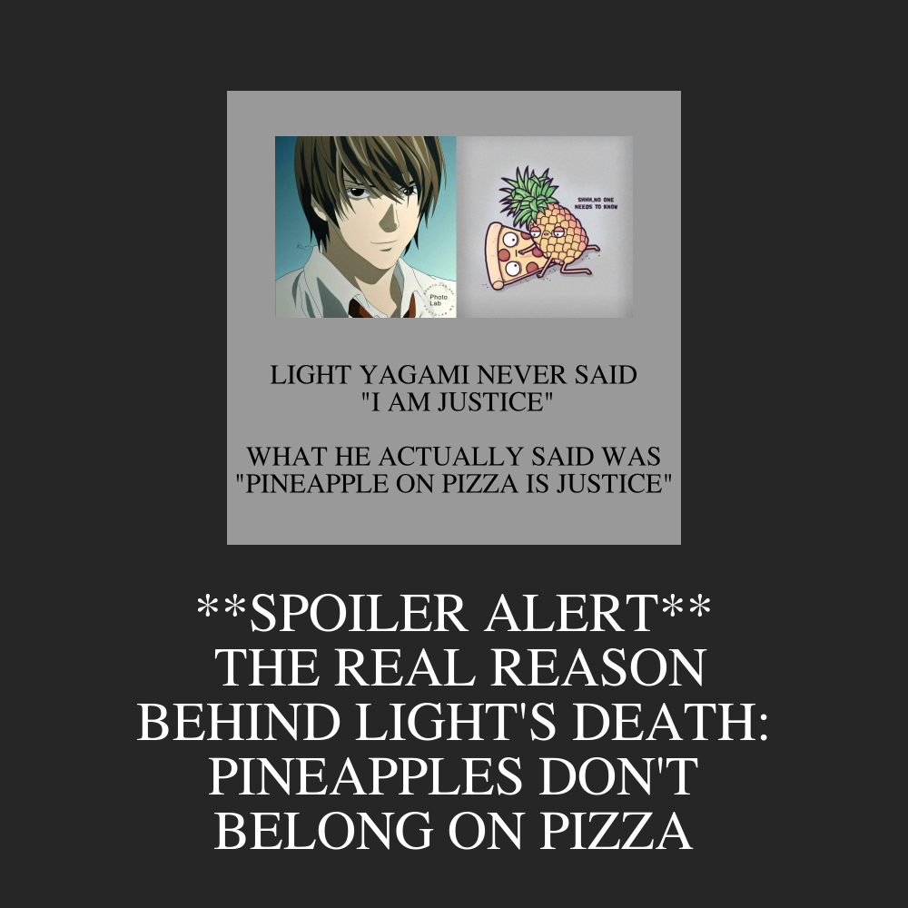

# Assignment 1 Part A


## Original images

Two images from the internet were used for this part of the assignment.

**Image 1**


[source](http://pm1.narvii.com/7128/0203be218630f805fdc73051a88fa946ff21cbb3r1-849-852v2_uhq.jpg)

**Image 2**


[source](https://i.pinimg.com/originals/ec/b5/61/ecb561fe40a1e523dd4f9486cd15d235.jpg)


## My code
```{r}
library(magick)

light_img <- image_read("images/light.jpeg") %>%
  image_scale("x400")
pizza_img <- image_read("images/pizza.jpeg") %>%
  image_scale("x400")

side1 <- image_blank(width = 106,
                     height = 400,
                     color = "#999999")
top1 <- image_blank(width = 1000,
                    height = 100,
                    color = "#999999")

text1 <- image_blank(width = 1000,
                     height = 500,
                     color = "#999999") %>%
  image_annotate(text = "LIGHT YAGAMI NEVER SAID\n \"I AM JUSTICE\"\n\nWHAT HE ACTUALLY SAID WAS\n\"PINEAPPLE ON PIZZA IS JUSTICE\"",
                 color = "#000000",
                 size = 60,
                 font = "Times",
                 gravity = "center")

middle1 <- image_append(c(side1, light_img, pizza_img, side1))
meme1 <- image_append(c(top1, middle1, text1), stack = TRUE) %>%
  image_scale(500)

side2 <- image_blank(width = 250,
                     height = 500,
                     color = "#262626")
top2 <- image_blank(width = 1000,
                    height = 100,
                    color = "#262626")

text2 <- image_blank(width = 1000,
                     height = 400,
                     color = "#262626") %>%
  image_annotate(text = "**SPOILER ALERT**\n THE REAL REASON\nBEHIND LIGHT'S DEATH:\nPINEAPPLES DON'T\nBELONG ON PIZZA",
                 color = "#ffffff",
                 size = 60,
                 font = "Times",
                 gravity = "center")

middle2 <- image_append(c(side2, meme1, side2))
meme2 <- image_append(c(top2, middle2, text2), stack = TRUE)
image_write(meme2, "my_meme.png")
```


## My meme



## What was the motivation?
* I love food 🍟
* I love anime 🎌
* So, my brain was full of food and anime-related memes.


## How is the meme is original?
* There are a lot of Light Yagami memes and pineapple on pizza memes on the internet, but never both of them in the same meme.
* The format is uncommon. Most students probably use the standard grid as demonstrated in the example, but I chose to do a meme inside another meme. Ten rectangles were combined in a more complicated manner after careful calculation.
* Many values were chosen by me after browsing through options, making the meme unique. This includes calculation of dimensions, font size, font, colours and more...
